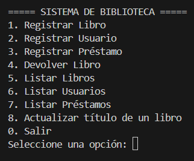

# Sistema de Biblioteca en Python y MySQL

## Descripción

---
### Este proyecto implementa un sistema de gestión de biblioteca desarrollado en Python con conexión a una base de datos MySQL.
Permite registrar, consultar y administrar libros, usuarios y préstamos, además de actualizar títulos y devolver libros.

El sistema se ejecuta en la terminal mediante un menú interactivo.


## Funcionalidades principales
### Libros
- **Registrar nuevos libros.**

- **Listar todos los libros con su estado (Disponible/Prestado).**

- **Actualizar el título de un libro.**

- **Cambiar el estado de disponibilidad al prestar o devolver.**
---
### Usuarios
- **Registrar usuarios (Alumno o Profesor).**

- **Listar todos los usuarios registrados.**
---
### Préstamos
- **Registrar préstamos (solo si el libro está disponible).**

- **Devolver libros (actualiza la disponibilidad).**

- **Listar todos los préstamos con su estado (Activo o Devuelto).**
---
### Estructura de la base de datos
#### Crea la base de datos biblioteca en MySQL y usa las siguientes tablas:


```
CREATE DATABASE biblioteca;
USE biblioteca;

CREATE TABLE libros (
    id INT AUTO_INCREMENT PRIMARY KEY,
    titulo VARCHAR(100),
    autor VARCHAR(100),
    anio INT,
    disponible BOOLEAN DEFAULT TRUE
);

CREATE TABLE usuarios (
    id INT AUTO_INCREMENT PRIMARY KEY,
    nombre VARCHAR(100),
    tipo VARCHAR(50)
);

CREATE TABLE prestamos (
    id INT AUTO_INCREMENT PRIMARY KEY,
    id_usuario INT,
    id_libro INT,
    fecha_prestamo DATE,
    fecha_devolucion DATE,
    FOREIGN KEY (id_usuario) REFERENCES usuarios(id),
    FOREIGN KEY (id_libro) REFERENCES libros(id)
);


```
---
### Requisitos


- **Python 3.8 o superior**

- **MySQL Server**

- **Librería ```mysql-connector-python```**
#### Instálala con:
```
pip install mysql-connector-python

```
---
### Ejecución
- **Clona o descarga el proyecto.**

- **Asegúrate de tener creada la base de datos ```biblioteca``` con las tablas indicadas.**

- **Actualiza las credenciales de conexión si es necesario:**

```
user="root",
password="toor"
```
#### Ejecuta el programa:

```
python biblioteca.py

```
---
## Menú principal



---
## Conceptos aplicados

- **Programación Orientada a Objetos (clases: ```Libro```, ```Usuario```, ```Prestamo```, ```ConexionBD```)**

- **Encapsulamiento de atributos privados (```__atributo```)**

- **Manejo de excepciones**

- **Consultas SQL parametrizadas (prevención de inyecciones)**

- **Persistencia de datos con MySQL**

- **Menú interactivo en consola**
---


